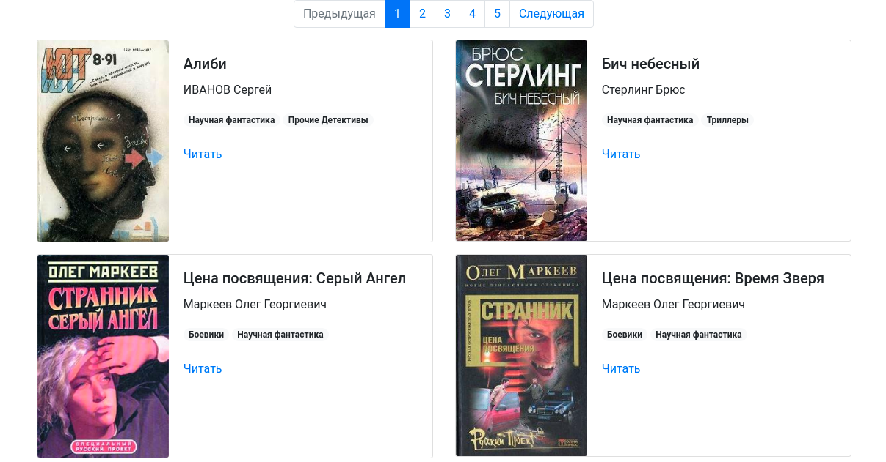

# Парсер книг с сайта tululu.org для создания офлайн-библиотеки

Проект предназначен для скачивания книг с сайта [tululu.org](https://tululu.org) и отображения их в виде страниц офлайн-библиотеки.



Пример можно посмотреть на [GitHub Pages](https://alena-yudzina.github.io/books_downloader/pages/index1.html).

## Как установить

```
pip3 install -r requirements.txt
```

## Аргументы

Программу можно использовать несколькими способами:

### 1. Скачивание книг по номерам страниц.

Программе необходимо передавать 2 аргумента: `start_page_id` и `end_page_id`.

```
python3 download.py 10 20
```

### 2. Скачивание книг из категории научная фантастика с формированием файла-описания в формате JSON.

Программе можно передавать следующие аргументы:

`start_page`, `end_page`, `dest_folder`, `skip_txt`, `skip_imgs`, `json_path`.
```
python3 parse_tululu_category.py --start_page 5 --end_page 10 --skip_txt --json_path /Users/Harry/downloads
```

### 3. Создание офлайн-библиотеки по скачанным книгам.
```
python3 render_website.py
```
Офлайн-библиотека будет храниться по адресу `корень_проекта/website/pages`. JSON-файл с описанием библиотеки (см. предыдущий шаг) должен лежать в корне проекта.

### 4. Скачивание готовой офлайн-библиотеки на компьютер.

[Скачать архив проекта](https://github.com/alena-yudzina/books_downloader/archive/refs/heads/master.zip) и открыть в браузере `docs/index1.html`.

### Цель проекта

Код написан в образовательных целях на онлайн-курсе для веб-разработчиков [dvmn.org](https://dvmn.org/).